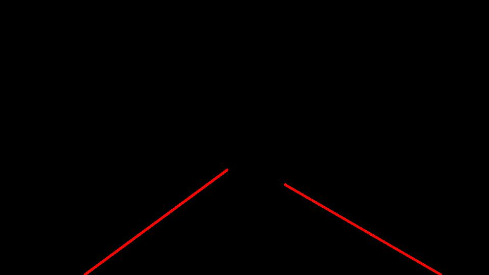

# **Finding Lane Lines on the Road** 

## Writeup

---

**Finding Lane Lines on the Road**

The goals / steps of this project are the following:
* Make a pipeline that finds lane lines on the road
* Reflect on your work in a written report


---

### Reflection

### 1. Describe your pipeline. As part of the description, explain how you modified the draw_lines() function.

To process the images I implemented an automatic pipeline, which iterates trough all picture and videos for image detection. The output folder are automatically generated if they don't exist.

The line-detection-pipeline is implemented in the method *detect_lines(img,drawing_mode=0)* for reusability. Its only input is the provide image or video frame and it returns the modified image highlighting the detected lines. Depending if the parameter *drawing_mode* is equal or unequal zero two drawing modes are available. For *drawing_mode=0* each detected line element is displayed individual. *drawing_mode=1* enables drawing a consolidated line for each side of the vehicle as requested in the last part of the exercise.

The line-detection-pipeline pipeline consists of five essential steps and a drawing procedure. Every example is given is based on the example image *solidYellowCurve2.jpg*:


* In the first step irrelevant parts of the image are cut out. Therefore the function *get_roi(img, top_y_perc, top_x_perc = 0,bottom_y_perc=0,bottom_x_perc=0)* is implemented. Its inputs are the original image and regions of the image that should be ignored. These regions are provided in relationship to the actual image size and generate a region of interest as trapezoid. This approach guarantees symmetry, adapts to varying image sizes (e.g. *challenge.mp4* vs. *solidWhiteRight.mp4*) and accounts effects of the perspective. The irrelevant parts are then set as black using the given function *region_of_interest*. The standard parameterization is that 60% of the upper and 5% from the lower end of the image are removed. These modifications account for heaven, clouds and the ego-vehicle-body. Additionally the left and right parts of the image are also elliminated so that a trapezoid is generated which uses the full width of the image at the bottom and 10% of the image width at the top. Thus, almost only lane and road relevant parts of the image are considered:

 

* The next part of the pipeline implements a color based filter to eliminate every pixel, which does not have a high intensity. In this case this is performed using a color threshold of *(190,190,190)*. A higher value avoids a detection of far lane segments. Additionally parts with only a high intensity of blue are removed as there are no blue lane markings. This leads to following result:


* The third part of the pipeline blurs the image in order to avoid unwanted edges and lines in the image in the follwoing canny-edge-filter:

 

* Next a canny-edge-filter is applied to the blured image and gives us detected edges. After applying the canny-edge-filter the region of interest is applied again to the result with slightly smaller bound in order to avoid edges resulting from the bounds of the initial region of interest. Leading to following result:


 
* In the fifth step the hough transformation is applied to the result of the canny-edge-filter. The hough filter is parameterized to accept lines of a minimum length of 10 pixels and a maximum gap between each pixel of 3. It's noteworthy that the angular resolution was set to 0.1deg to get a better overall fit, especially when fitting the entire line. As visible in the picture the pipeline gave pretty good results. However some of the credit has to be given to the plot-function "draw-line", which is explained next.


* As mentioned afore in this project are two different plot functions implemented, one plotting all valid lines from the hough transformation and one fitting an entire line. The results for the first part are given in the previous figure and for the line fitting in the subsequent one.
The algorithm to plot lines are based for both variants on a similar foundation. 
  * During the drawing algorithm we iterate trough every identified line. Thereby, the first processing step is to calculate the angle of the given segment via ```np.arctan((x2-x1)/(y2-y1))``` and projecting the line on the bottom of the image with ``` offset = x1 + ((x2-x1)/(y2-y1))*(img.shape[0] -1 - y1) ```using the gradient of the line and the image size. With the value offset* it is possible to determine wether the line is left or right in relationship to the camera: 
  ```
  side = float(offset - 0.5*image.shape[1])/(0.5*float(image.shape[1]))
  ```
  If side is negative the virtual infinite line starts left of the vehicle. It can be noticed that the angle of a valid line has in almost every case the same sign as the corresponding side value. Though this assumption will most likely fail on thight corners it fits very well in this case even more as due to the distortion due to the perspective the angle will tend even more to this assumption the farther they are in front of the vehicle. Thus, we test for the angle lying in a certain range and the condition for matching sign of side and angle. However, for lines that appear near center the sign condition is ommited. This leads to following statement, which has to be fulfilled to mark this line as valid:
  ```
  (angle_abs >= tol_orientation[0]) & (angle_abs <= tol_orientation[1]) & ((np.absolute(side) < 0.2) | (side*angle > 0)).
  ```
  If we are in *drawing mode==0*, a valid line has been found and is drawn onto the image. For *drawing_mode!=0* we have to do some additional calculation. First it has to be mentioned that we need a buffer, one for each side, with 4 floats that have to be initialized with zero at the start of draw_lines. When we reach a valid line, we calculate the length of this line segment. Depending on which side it lies the length, the offset-value and the angle are accumulated independently into the corresponding buffer. Afore, the values for offset and angle have been weighted by the length of the segment. After all lines are processed, we take a look if at least one valid line was found for each side. Then we calculate the weighted mean value for offset and angle and use them to draw a corresponding line on the image.



* Finally the output image is generated as a merge of the input image and the result from the hough transformation with a 50:50 weighting.:


### 2. Identify potential shortcomings with your current pipeline

The main drawback of the current pipeline is that relies heavily on edge-detection and clustering by color and region. This leads to problems, when other car's are in the ego-vehicle lane as they are within the region of interests and can be white or just bright and therefore can be a source for falsly detected lines. Additionally the contrast of the lines has to be significant in order to achieve a good result. This led to problems when applying the pipeline to *challenge.mp4*. Further problems can arise if the region of interest is not valid, e.g. in San Francisco driving with a dynamic slope. 
No quality of the detected line is estimated.


### 3. Suggest possible improvements to your pipeline

From my technical background I would use a tracking-filter (e.g. Kalman-Filter) in order to stabilize line estimates based on previous estimates.
Additionaly left and right line markings obviously correlates, thus they can be used to stabilize each other. Especially if a bad visible or even no line exists an assumption can be made in order to shrink the trust region to a reasonable size.
